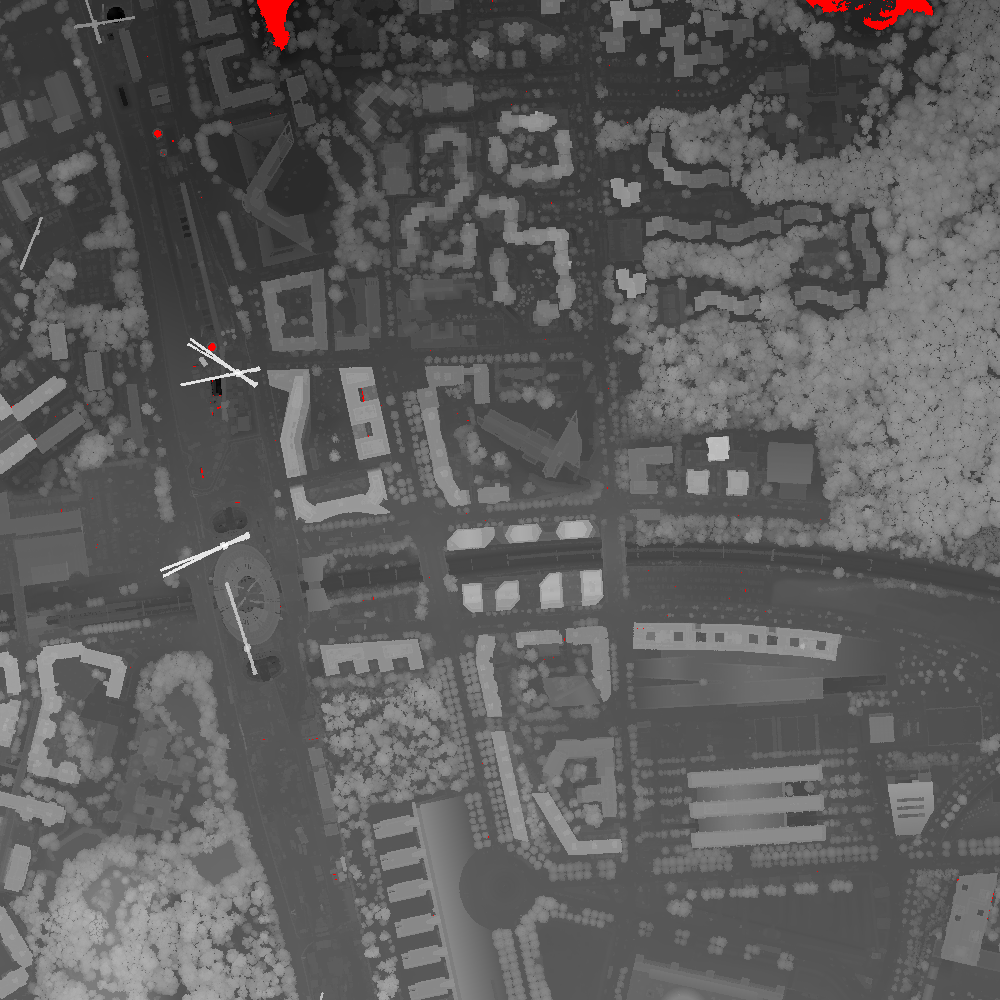

# Avancement

## Mercredi 24 septembre
- Échange avec nos commanditaires  
- Création du projet GitHub  
- Consultation d’articles scientifiques en lien avec le projet  

## Mercredi 01 octobre
- Échange avec nos commanditaires  
- Création d’un fichier de lecture des données LiDAR  
- Lecture poussée d’articles scientifiques ciblés  

## Mercredi 15 octobre
- Échange avec nos commanditaires
- Stockage des données en Numpy / DataFrame
- Création de MNS depuis des données LiDAR

- Lecture poussée d’articles scientifiques ciblés

## Mercredi 22 octobre
- Échange avec nos commanditaires
- Création d'un modèle voxelisé 'couche par couche'
- Lecture d'un nouvel article scientifique centré sur les graphes au sein d'un modèle voxelisé

## Mercredi 5 novembre
- Échange avec nos commanditaires
- Création d'un modèle LEGO grâce à la librairie LDRAW
