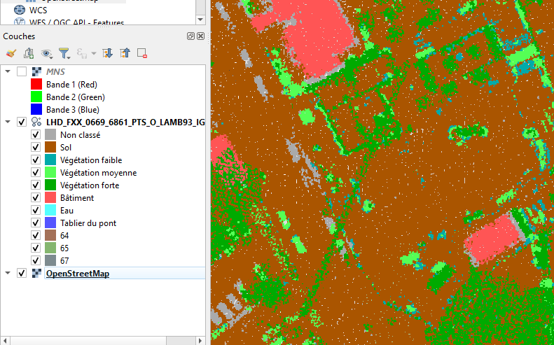

# Recherche

## Tierlist des ARTICLES (+méthode, algo)

### S

---

### A

- **A.1** [https://dl.acm.org/doi/pdf/10.1145/2739480.2754667](https://dl.acm.org/doi/pdf/10.1145/2739480.2754667)  
  *Finding an Optimal LEGO Brick Layout of Voxelized 3D Object Using a Genetic Algorithm*  
  (S'occupe des problèmes de voxelisation et d'assemblage optimisé avec les briques)

- **A.2** [https://www.sciencedirect.com/science/article/abs/pii/S1077316985710398](https://www.sciencedirect.com/science/article/abs/pii/S1077316985710398)  
  *Fundamentals of Surface Voxelization*  
  (Payant mais intéressant pour comprendre le problème de voxelisation)

- **A.3** [https://miis.maths.ox.ac.uk/miis/623/1/LegoModelAutomation.pdf](https://miis.maths.ox.ac.uk/miis/623/1/LegoModelAutomation.pdf)  
  *Lego: Automated model construction*  
  (PDF non copiable)

- **A.4** [https://dl.acm.org/doi/pdf/10.1145/3095140.3095180](https://dl.acm.org/doi/pdf/10.1145/3095140.3095180)  
  *Legorization with multi-height bricks from silhouette-fi‚ed voxelization*  
  (voxelisation et legorization)

- **A.5** [https://www.mdpi.com/1424-8220/21/24/8241](https://www.mdpi.com/1424-8220/21/24/8241)  
  *Voxelisation Algorithms and Data Structures: A Review*

- **A.6** [https://www.sciencedirect.com/science/article/pii/S1569843223000304](https://www.sciencedirect.com/science/article/pii/S1569843223000304)  
  *Point cloud voxel classification of aerial urban LiDAR using voxel attributes and random forest approach*

---

### B

---

### C

---

### D

- [https://ascelibrary.org/doi/abs/10.1061/(ASCE)SU.1943-5428.0000097](https://ascelibrary.org/doi/abs/10.1061/(ASCE)SU.1943-5428.0000097)  
  *Point Cloud Data Conversion into Solid Models via Point-Based Voxelization* (payant)

- [https://openaccess.thecvf.com/content/ICCV2021/papers/Xu_RPVNet_A_Deep_and_Efficient_Range-Point-Voxel_Fusion_Network_for_LiDAR_ICCV_2021_paper.pdf](https://openaccess.thecvf.com/content/ICCV2021/papers/Xu_RPVNet_A_Deep_and_Efficient_Range-Point-Voxel_Fusion_Network_for_LiDAR_ICCV_2021_paper.pdf)  
  *RPVNet: A Deep and Efficient Range-Point-Voxel Fusion Network for LiDAR*  
  Point Cloud Segmentation

---

## Résumé

- **A.1**  
  Voxelisation modèle 3D (réduction de l’objet en une grille de voxels)  
  “layout” (couche) de briques Lego : chaque brique recouvre un certain nombre de voxels en respectant les formes des briques Lego  
  Algorithme génétique :  
    - Solidité de l'algo  
    - Fidélité à la forme originale  
    - Nombre et type de briques (minimisation des coûts/complexité)  
  => nouvelle méthodo

- **A.2** (article payant, résumé grâce à ChatGpt)  
  Algorithmes voxelisation de surfaces polygonales (par exemple: triangles ou polygones)  
  Gestion des cas limites (aliasing (?), trous dans la surface voxelisée)  
  Fidélité (préservation des détails, gestion des arêtes fines)  
  Discussion sur les compromis résolution/rapidité/mémoire  
  => choisir méthode adaptée selon le nuage de points ou de la modélisation

- **A.3**  
  Voxelisation modèle 3D  
  Sélection de briques à partir de la grille de voxels en tenant compte des difficultés  
  Génération instructions de montage étape par étape  
  => intéressant pour les fiches de montage, problème de montage toujours layer par layer, pas de code (algorithme à implémenter)

- **A.4**  
  Bric à brac voxelisation et optimisation assemblage  
  Voxelisation par rapport à la silhouette du modèle  
  Algorithmes d’assemblage  
  => optimiser nbr de pièces

- **A.5**  
  Prétraitement points Lidar  
  Grille voxelisée adaptée à la densité des points  
  Extraction des bâtiments, arbres etc.  
  Accélérer la voxelisation sur de grands volumes de données  
  => première étape avant voxelisation, transformer des données Lidar en modèles voxelisés

- **A.6**  
  Familles de voxelisation (volumique, surfacique, directe depuis nuages de points (ce qui nous intéresse))  
  Conseils pour ajuster la taille des voxels et post-traiter résultats  
  => complément sur la voxelisation et des bonnes pratiques

---

## Idée chaîne de traitements

Prétraitement Lidar (A.5) → Voxelisation (A.2, A.4) → Optimisation assemblage Lego (A.1, A.4) → Génération des instructions (A.3)

---

## Critique LIDAR

Grue confondue avec végétation forte
 

