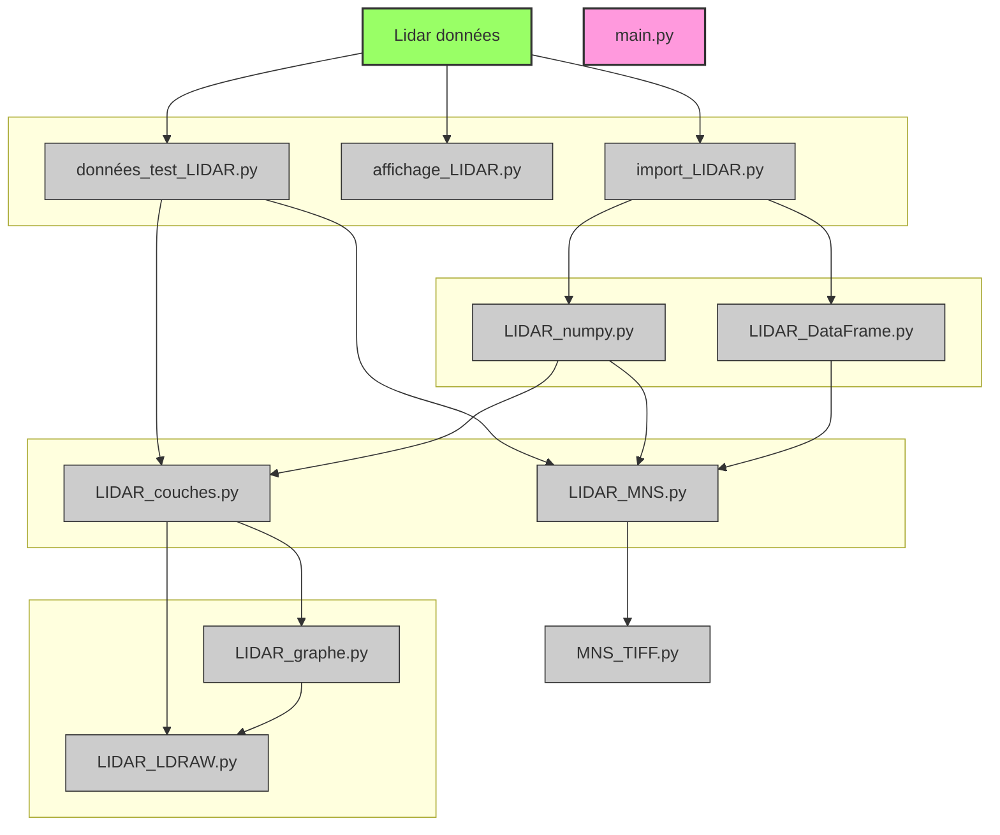

```mermaid 
graph TD;

A[Lidar données]

subgraph L1[" "]
    B[données_test_LIDAR.py]
    C[affichage_LIDAR.py]
    D[import_LIDAR.py]
end

subgraph L2[" "]
    E[LIDAR_numpy.py]
    F[LIDAR_DataFrame.py]
end

subgraph L3[" "]
    G[LIDAR_MNS.py]
    I[LIDAR_couches.py]
end

subgraph L4[" "]
    J[LIDAR_LDRAW.py]
    K[LIDAR_graphe.py]
end

H[MNS_TIFF.py]
M[main.py]

A --> B
A --> C
A --> D
D --> E
D --> F
B --> G
E --> G
F --> G
B --> I
E --> I
I --> J
I --> K
K --> J
G --> H


    %% Styles des couleurs
    style A fill:#9f6,stroke:#333,stroke-width:2px
    style B fill:#ccc,stroke:#333,stroke-width:1px
    style C fill:#ccc,stroke:#333,stroke-width:1px
    style D fill:#ccc,stroke:#333,stroke-width:1px
    style E fill:#ccc,stroke:#333,stroke-width:1px
    style F fill:#ccc,stroke:#333,stroke-width:1px
    style G fill:#ccc,stroke:#333,stroke-width:1px
    style H fill:#ccc,stroke:#333,stroke-width:1px
    style I fill:#ccc,stroke:#333,stroke-width:1px
    style J fill:#ccc,stroke:#333,stroke-width:1px
    style K fill:#ccc,stroke:#333,stroke-width:1px
    style M fill:#f9d,stroke:#333,stroke-width:2px

    
```
