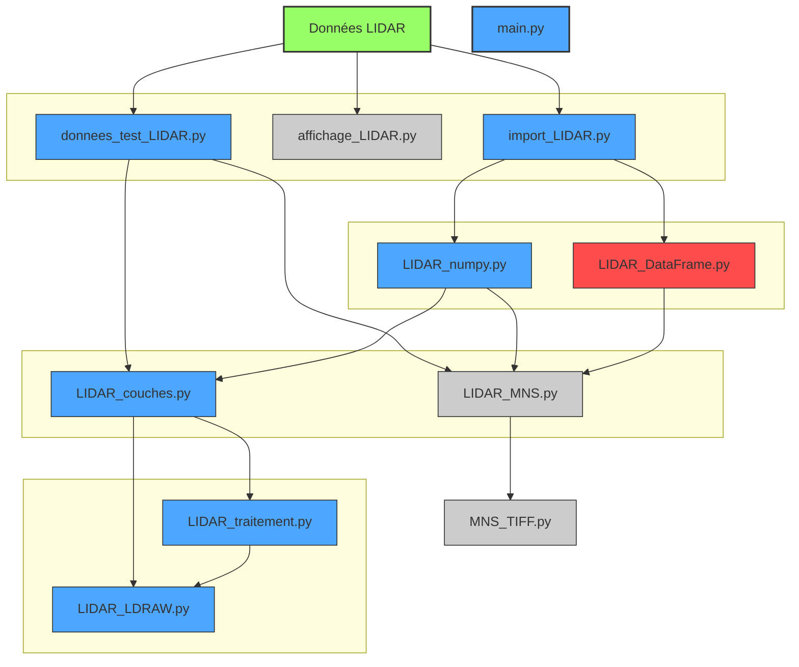

```mermaid 
graph TD;

A[Données LIDAR]

subgraph L1[" "]
    B[donnees_test_LIDAR.py]
    C[affichage_LIDAR.py]
    D[import_LIDAR.py]
end

subgraph L2[" "]
    E[LIDAR_numpy.py]
    F[LIDAR_DataFrame.py]
end

subgraph L3[" "]
    G[LIDAR_MNS.py]
    I[LIDAR_couches.py]
end

subgraph L4[" "]
    J[LIDAR_LDRAW.py]
    K[LIDAR_traitement.py]
end

H[MNS_TIFF.py]
M[main.py]

A --> B
A --> C
A --> D
D --> E
D --> F
B --> G
E --> G
F --> G
B --> I
E --> I
I --> J
I --> K
K --> J
G --> H


%% Styles des couleurs
style A fill:#9f6,stroke:#333,stroke-width:2px        
style B fill:#4da6ff,stroke:#333,stroke-width:1px    
style C fill:#ccc,stroke:#333,stroke-width:1px       
style D fill:#4da6ff,stroke:#333,stroke-width:1px   
style E fill:#4da6ff,stroke:#333,stroke-width:1px    
style F fill:#ff4d4d,stroke:#333,stroke-width:1px    
style G fill:#ccc,stroke:#333,stroke-width:1px       
style H fill:#ccc,stroke:#333,stroke-width:1px       
style I fill:#4da6ff,stroke:#333,stroke-width:1px   
style J fill:#4da6ff,stroke:#333,stroke-width:1px   
style K fill:#4da6ff,stroke:#333,stroke-width:1px    
style M fill:#4da6ff,stroke:#333,stroke-width:2px    


    
```
