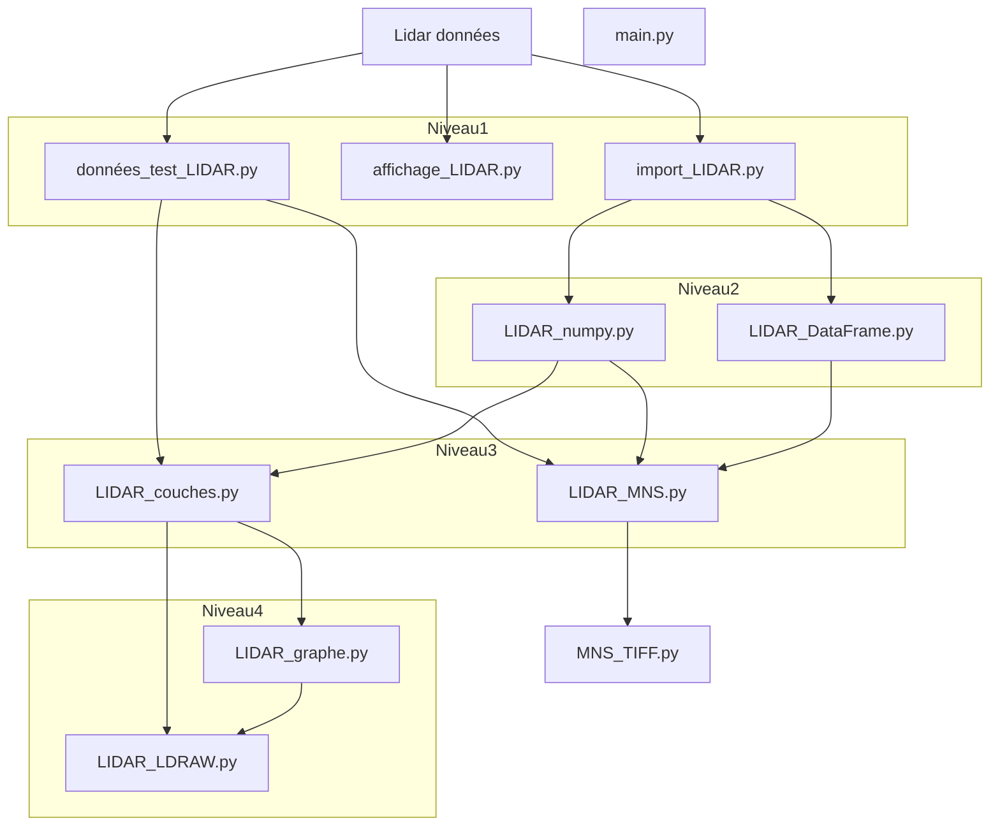

```mermaid
graph TD;

    %% Niveau 0
    A[Lidar données]

    %% Niveau 1
    subgraph Niveau1
        B[données_test_LIDAR.py]
        C[affichage_LIDAR.py]
        D[import_LIDAR.py]
    end

    %% Niveau 2
    subgraph Niveau2
        E[LIDAR_numpy.py]
        F[LIDAR_DataFrame.py]
    end

    %% Niveau 3
    subgraph Niveau3
        G[LIDAR_MNS.py]
        I[LIDAR_couches.py]
    end

    %% Niveau 4
    subgraph Niveau4
        J[LIDAR_LDRAW.py]
        K[LIDAR_graphe.py]
    end

    %% Niveau 5
    H[MNS_TIFF.py]

    %% Main externe
    M[main.py]

    %% Connexions
    A --> B
    A --> C
    A --> D

    D --> E
    D --> F

    B --> G
    E --> G
    F --> G

    B --> I
    E --> I

    I --> J
    I --> K
    K --> J

    G --> H

    %% Main.py sur le côté
    M

    
```
