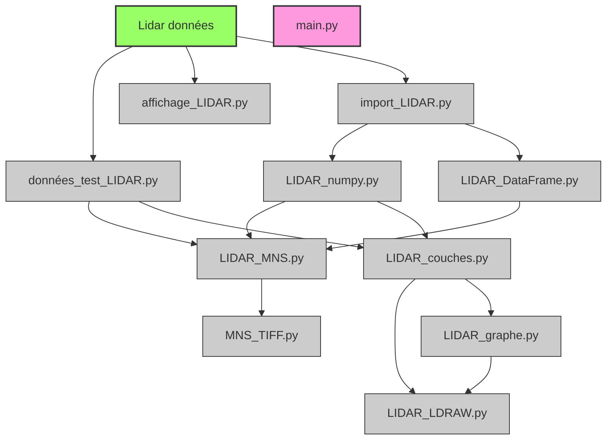

```mermaid 
graph TD;

    %% Niveau 0
    A[Lidar données]

    %% Niveau 1
    B[données_test_LIDAR.py]
    C[affichage_LIDAR.py]
    D[import_LIDAR.py]

    %% Niveau 2
    E[LIDAR_numpy.py]
    F[LIDAR_DataFrame.py]

    %% Niveau 3
    G[LIDAR_MNS.py]
    I[LIDAR_couches.py]

    %% Niveau 4
    J[LIDAR_LDRAW.py]
    K[LIDAR_graphe.py]

    %% Niveau 5
    H[MNS_TIFF.py]

    %% Main externe
    M[main.py]

    %% Connexions
    A --> B
    A --> C
    A --> D

    D --> E
    D --> F

    B --> G
    E --> G
    F --> G

    B --> I
    E --> I

    I --> J
    I --> K
    K --> J

    G --> H


    %% Main.py sur le côté
    M

    %% Styles des couleurs
    style A fill:#9f6,stroke:#333,stroke-width:2px
    style B fill:#ccc,stroke:#333,stroke-width:1px
    style C fill:#ccc,stroke:#333,stroke-width:1px
    style D fill:#ccc,stroke:#333,stroke-width:1px
    style E fill:#ccc,stroke:#333,stroke-width:1px
    style F fill:#ccc,stroke:#333,stroke-width:1px
    style G fill:#ccc,stroke:#333,stroke-width:1px
    style H fill:#ccc,stroke:#333,stroke-width:1px
    style I fill:#ccc,stroke:#333,stroke-width:1px
    style J fill:#ccc,stroke:#333,stroke-width:1px
    style K fill:#ccc,stroke:#333,stroke-width:1px
    style M fill:#f9d,stroke:#333,stroke-width:2px

    
```
