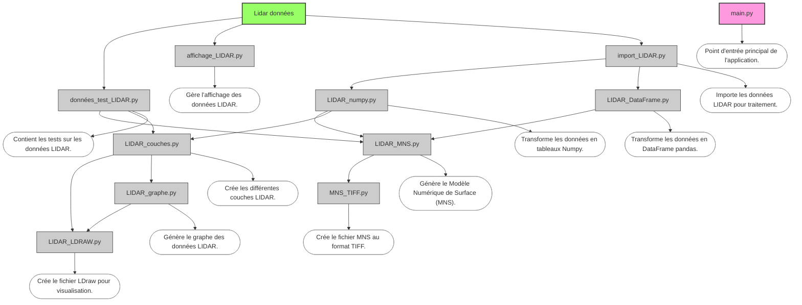

```mermaid
graph TD;

    %% Nœuds principaux
    A[Lidar données] --> B[données_test_LIDAR.py]
    A --> C[affichage_LIDAR.py]
    A --> D[import_LIDAR.py]

    D --> E[LIDAR_numpy.py]
    D --> F[LIDAR_DataFrame.py]

    B --> G[LIDAR_MNS.py]
    E --> G
    F --> G

    B --> I[LIDAR_couches.py]
    E --> I

    I --> J[LIDAR_LDRAW.py]
    I --> K[LIDAR_graphe.py]
    K --> J

    G --> H[MNS_TIFF.py]

    %% Main externe
    M[main.py]

    %% Notes explicatives
    B_note(["Contient les tests sur les données LIDAR."])
    C_note(["Gère l'affichage des données LIDAR."])
    D_note(["Importe les données LIDAR pour traitement."])
    E_note(["Transforme les données en tableaux Numpy."])
    F_note(["Transforme les données en DataFrame pandas."])
    G_note(["Génère le Modèle Numérique de Surface (MNS)."])
    H_note(["Crée le fichier MNS au format TIFF."])
    I_note(["Crée les différentes couches LIDAR."])
    J_note(["Crée le fichier LDraw pour visualisation."])
    K_note(["Génère le graphe des données LIDAR."])
    M_note(["Point d'entrée principal de l'application."])

    %% Connexion notes
    B --> B_note
    C --> C_note
    D --> D_note
    E --> E_note
    F --> F_note
    G --> G_note
    H --> H_note
    I --> I_note
    J --> J_note
    K --> K_note
    M --> M_note

    %% Styles des couleurs
    style A fill:#9f6,stroke:#333,stroke-width:2px
    style B fill:#ccc,stroke:#333,stroke-width:1px
    style C fill:#ccc,stroke:#333,stroke-width:1px
    style D fill:#ccc,stroke:#333,stroke-width:1px
    style E fill:#ccc,stroke:#333,stroke-width:1px
    style F fill:#ccc,stroke:#333,stroke-width:1px
    style G fill:#ccc,stroke:#333,stroke-width:1px
    style H fill:#ccc,stroke:#333,stroke-width:1px
    style I fill:#ccc,stroke:#333,stroke-width:1px
    style J fill:#ccc,stroke:#333,stroke-width:1px
    style K fill:#ccc,stroke:#333,stroke-width:1px
    style M fill:#f9d,stroke:#333,stroke-width:2px

    style B_note fill:#fff,stroke:#999,stroke-width:1px
    style C_note fill:#fff,stroke:#999,stroke-width:1px
    style D_note fill:#fff,stroke:#999,stroke-width:1px
    style E_note fill:#fff,stroke:#999,stroke-width:1px
    style F_note fill:#fff,stroke:#999,stroke-width:1px
    style G_note fill:#fff,stroke:#999,stroke-width:1px
    style H_note fill:#fff,stroke:#999,stroke-width:1px
    style I_note fill:#fff,stroke:#999,stroke-width:1px
    style J_note fill:#fff,stroke:#999,stroke-width:1px
    style K_note fill:#fff,stroke:#999,stroke-width:1px
    style M_note fill:#fff,stroke:#999,stroke-width:1px


    
```
